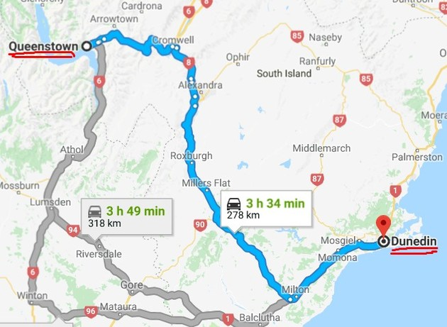

# NZ-Apr2018

* 3.31 14:15 Pudong -> 4.1 06:50 Auckland  
* 4.1 8:00 Auckland -> 4.1 9:25 Christchurch
* 4.8 20:00 Christchurch -> 4.8 21:20 Auckland
* 4.8 23:00 Auckland -> 4.9 7:15 Pudong
***

***
### 4.1
@Christchurch  
Jet lag, city tour

### 4.2
@Christchurch -> Lake tepako  

### 4.3
@Lake tepako -> Mount cook -> Twizel  

### 4.4
@Twizel -> Queenstown  

### 4.5
@Queenstown  

### 4.6
@Queenstown -> Dunedin  

### 4.7
@Dunedin -> Christchurch  

### 4.8
@Christchurch  
flight
***
| STAY          | LOCATION        | COUNT    |
| ------------- |:-----------:|:--------:|
| @Christchurch | Modern, Private + Amazing Location (Lisa)| 4.1-4.2, 1 night |
| @Lake Tepako  | Black Tussock (Tj)| 4.2-4.3, 1 night  |
| @Twizel       | Relax On Rata - Cottage 1 (Amy)| 4.3-4.4, 1 night  |
| @Queenstown   | Central location with parking (Michael)|4.4-4.6, 2 nights |
| @Dunedin      | Hulmes Court Bed And Breakfast (Booking)|4.6-4.7, 1 night  |
| @Christchurch | Central location with parking (Isabelle)|4.7, 1 night  |
