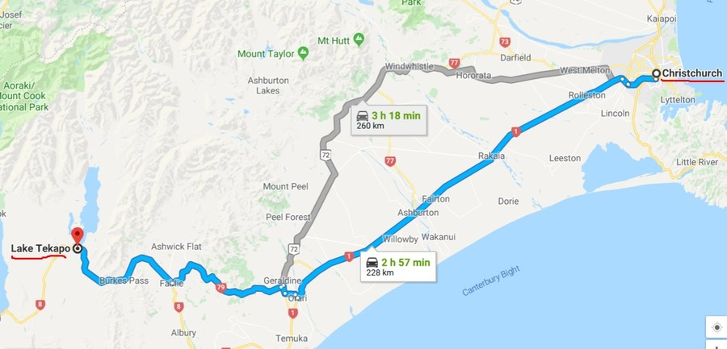
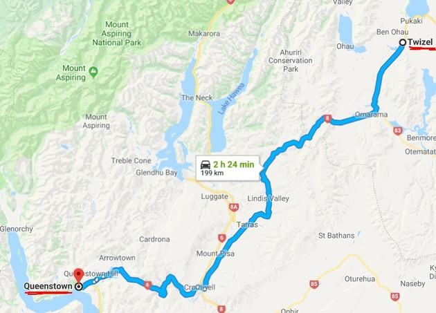

# NZ-Apr2018

* 3.31 14:15 Pudong -> 4.1 05:50 Auckland  
* 4.1 8:00 Auckland -> 4.1 9:25 Christchurch
* 4.8 20:00 Christchurch -> 4.8 21:20 Auckland
* 4.8 23:00 Auckland -> 4.9 7:15 Pudong
***
### 4.1
@Christchurch  
Jet lag, city tour

### 4.2
@Christchurch <--> Akaroa  
drive, bay visit  

### 4.3
@Christchurch -> Lake Tepaku  

### 4.4
@Lake Tepaku -> Lake Pukaki -> Wanaka  

### 4.5
@Wanaka -> Te Anau  

### 4.6
@ Milford Sound  
drive - boat  

### 4.7
@ Te Anau -> Queenstown  
Drive, Glenorchy, Arrowtown  

### 4.8
@ QueueTown ->  Christchurch  
flight
***
| STAY            | TIME        | COUNT    |
| --------------- |:-----------:|:--------:|
| @Christchurch   | 4.1-4.3     | 2 nights |
| @Lake Tepaku    | 4.3         | 1 night  |
| @Wanaka         | 4.4         | 1 night  |
| @Te Anau        | 4.5-4.7     | 2 nights |
| @Queenstown     | 4.7         | 1 night  |
